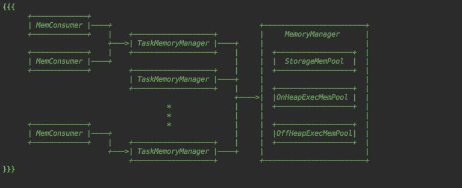
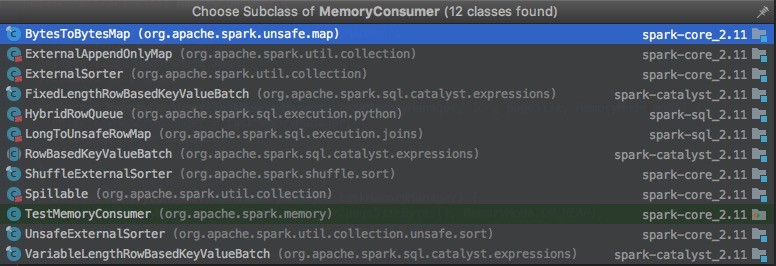

# Spark的内存模型
## 内存管理
* 从内存管理上来看。Spark的内存分为两部分  
1. 一部分用来缓存数据（Storage:cache,transfer）
2. 一部分用来执行做计算（Execution:join,shuffle,groupBy,sort etc）.

 
### V1.6之前

Storage和Execution内存是静态的。由StaticMemoryManager管理。

max(storage memory) = JVM的最大内存 乘以️0.6(由spark.storage.memoryFraction参数控制) 乘以 0.9(safetyFraction)  
max(execution memory) = JVM的最大内存 乘以0.2(由spark.shuffle.memoryFraction参数控制) 乘以 0.8(safetyFraction)


```scala
  /**
   * Return the total amount of memory available for the storage region, in bytes.
   */
  private def getMaxStorageMemory(conf: SparkConf): Long = {
    val systemMaxMemory = conf.getLong("spark.testing.memory", Runtime.getRuntime.maxMemory)
    val memoryFraction = conf.getDouble("spark.storage.memoryFraction", 0.6)
    val safetyFraction = conf.getDouble("spark.storage.safetyFraction", 0.9)
    (systemMaxMemory * memoryFraction * safetyFraction).toLong
  }
  
  /**
     * Return the total amount of memory available for the execution region, in bytes.
     */
    private def getMaxExecutionMemory(conf: SparkConf): Long = {
      val systemMaxMemory = conf.getLong("spark.testing.memory", Runtime.getRuntime.maxMemory)
  
      if (systemMaxMemory < MIN_MEMORY_BYTES) {
        throw new IllegalArgumentException(s"System memory $systemMaxMemory must " +
          s"be at least $MIN_MEMORY_BYTES. Please increase heap size using the --driver-memory " +
          s"option or spark.driver.memory in Spark configuration.")
      }
      if (conf.contains("spark.executor.memory")) {
        val executorMemory = conf.getSizeAsBytes("spark.executor.memory")
        if (executorMemory < MIN_MEMORY_BYTES) {
          throw new IllegalArgumentException(s"Executor memory $executorMemory must be at least " +
            s"$MIN_MEMORY_BYTES. Please increase executor memory using the " +
            s"--executor-memory option or spark.executor.memory in Spark configuration.")
        }
      }
      val memoryFraction = conf.getDouble("spark.shuffle.memoryFraction", 0.2)
      val safetyFraction = conf.getDouble("spark.shuffle.safetyFraction", 0.8)
      (systemMaxMemory * memoryFraction * safetyFraction).toLong
    }
```

可以看到spark.storage.memoryFraction + spark.shuffle.memoryFraction 加起来是少于1的，并且都各有一个safetyFraction。

个人理解剩下部分内存是用于加载jar,函数执行的栈空间,临时变量,JVM的垃圾回收等操作。

### 1.6之后
默认使用UnifiedMemoryManager来管理内存。

源码中对UnifiedMemoryManager的描述如下:

```text
A [[MemoryManager]] that enforces a soft boundary between execution and storage such that
either side can borrow memory from the other.

The region shared between execution and storage is a fraction of (the total heap space - 300MB)
configurable through `spark.memory.fraction` (default 0.6). The position of the boundary
within this space is further determined by `spark.memory.storageFraction` (default 0.5).
This means the size of the storage region is 0.6 * 0.5 = 0.3 of the heap space by default.

Storage can borrow as much execution memory as is free until execution reclaims its space.
When this happens, cached blocks will be evicted from memory until sufficient borrowed
memory is released to satisfy the execution memory request.

Similarly, execution can borrow as much storage memory as is free. However, execution
memory is *never* evicted by storage due to the complexities involved in implementing this.
The implication is that attempts to cache blocks may fail if execution has already eaten
up most of the storage space, in which case the new blocks will be evicted immediately
according to their respective storage levels.
```

跟StaticMemoryManager的区别:

1、Storage和Executor共享内存。 

2、 预留300M系统内存。
```scala
  // Set aside a fixed amount of memory for non-storage, non-execution purposes.
  // This serves a function similar to `spark.memory.fraction`, but guarantees that we reserve
  // sufficient memory for the system even for small heaps. E.g. if we have a 1GB JVM, then
  // the memory used for execution and storage will be (1024 - 300) * 0.6 = 434MB by default.
  private val RESERVED_SYSTEM_MEMORY_BYTES = 300 * 1024 * 1024
```  

3、 配置项spark.memory.fraction,默认值0.6,用于配置当前MemoryManager的最大内存使用比例

4、Storage和Executor默认内存各为0.5.两者可以相互借用对方的内存,实现动态内存管理。

## 内存使用


 管理Tasks的TaskMemoryManager。

 <div  align="center"></div><br>
 
 每个task一个TaskMemoryManager。Task向TaskMemoryManager申请内存。所有TaskMemoryManager由MemoryManager管理。
 

* Spark内部使用的这些数据结构都继承了MemConsumer类。
 <div  align="center"></div><br>

Task执行的时候，这些数据结构会申请内存，如果内存不够调用spill函数写磁盘。


# 举例
看下AppendOnlyMap的spill函数：
```scala
  /**
   * Sort the existing contents of the in-memory map and spill them to a temporary file on disk.
   */
  override protected[this] def spill(collection: SizeTracker): Unit = {
    val inMemoryIterator = currentMap.destructiveSortedIterator(keyComparator)
    val diskMapIterator = spillMemoryIteratorToDisk(inMemoryIterator)
    spilledMaps += diskMapIterator
  }
```


1. 先按key排序。再调用DiskBlockObjectWriter把数据从内存刷到磁盘。完成spill过程。
2. appendOnlyMap里面spilledMaps里面记录了每次spill后的文件名字，大小，blockId。
