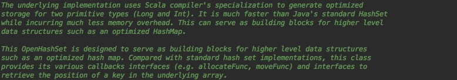

JDK的HashMap底层是用的数组，HashSet是基于HashMap（value为null）实现的。
Spark自己实现了一套高性能的HashMap和HashSet，据说比JDK自带的快一个数量级，缺点是只能添加元素不能删除。有意思的是跟JDK的实现相反。Spark的HashMap是用HashSet实现的。

OpenHashSet实现原理

 
  &emsp;&emsp;基本原理：基于specialized,解决java泛型拆箱装箱带来的性能问题。

内部细节：

初始化的大小为64.扩展因子为0.7

hash的key类型只能为Long和Int

添加元素。两个步骤 1：添加元素   2：是否需要重新hash

添加元素这个方法：用BitSet存储hash后的位置。_data数组存储具体数值。biset的index和_data数组的下标一一对应。
1：如果hash值不存在。数组里面添加该key,biset添加index索引，size +1
2：如果_data数组里面有一个元素，直接返回
3：如果hash值存在，并且是新元素，也就是有hash冲突了。采用线性探查（linear quadratic probing）。pos + 1,pos + 2 ...
回到第一步，直到找到一个没有值的pos.

contains方法类似。用线性探测查找。由于biset的get的时间复杂度是O(1)，contains方法的效率应该还不错。

