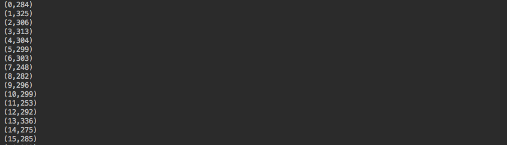

Graph生成一个图

```
    case class Person(name: String)

    case class Link(contactTimes: Int)

    val verticesRDD: RDD[(VertexId, Person)] = sparkSession.read.option("header", "true")
      .csv("xxx/*.csv")
      .rdd.map(x => (x(1).toString.toLong, Person(x(0).toString)))

    val linksRDD: RDD[Edge[Link]] = sparkSession.read.option("header", "true")
      .csv("yyy/*.csv")
      .rdd
      .map(x => Edge(x(0).toString.toLong,
        x(1).toString.toLong,
        Link(x(2).toString.toInt)))

    val social: Graph[Person, Link] = Graph(verticesRDD, linksRDD)
    social.persist()
 ```
输入为两个RDD,顶点RDD,边RDD。经过一系列的函数调用，最后由Graph的apply方法生成图。

```
  def apply[VD: ClassTag, ED: ClassTag](
      vertices: RDD[(VertexId, VD)],
      edges: RDD[Edge[ED]],
      defaultVertexAttr: VD = null.asInstanceOf[VD],
      edgeStorageLevel: StorageLevel = StorageLevel.MEMORY_ONLY,
      vertexStorageLevel: StorageLevel = StorageLevel.MEMORY_ONLY): Graph[VD, ED] = {
    GraphImpl(vertices, edges, defaultVertexAttr, edgeStorageLevel, vertexStorageLevel)
  }
```


再看看GraphImpl的内部结构。
```
class GraphImpl[VD: ClassTag, ED: ClassTag] protected (
    @transient val vertices: VertexRDD[VD],
    @transient val replicatedVertexView: ReplicatedVertexView[VD, ED])
  extends Graph[VD, ED] with Serializable {

  /** Default constructor is provided to support serialization */
  protected def this() = this(null, null)

  @transient override val edges: EdgeRDDImpl[ED, VD] = replicatedVertexView.edges

  /** Return an RDD that brings edges together with their source and destination vertices. */
  @transient override lazy val triplets: RDD[EdgeTriplet[VD, ED]] = {
    replicatedVertexView.upgrade(vertices, true, true)
    replicatedVertexView.edges.partitionsRDD.mapPartitions(_.flatMap {
      case (pid, part) => part.tripletIterator()
    })
  }
```

核心数据结构为顶点VertexRDD,边EdgeRDD，边以及两个顶点的属性 triplets：RDD[EdgeTriplet]


重点：在分布式环境下怎么高效的存储整张大图，减少不同机器之间的通信？怎么找到顶点和边partition的对应关系？

1、Spark的ParttitionStrategy提供了四种图的存储策略。

看下其中性能比较好的一种的策略：

```
case object EdgePartition2D extends PartitionStrategy {
    override def getPartition(src: VertexId, dst: VertexId, numParts: PartitionID): PartitionID = {
      val ceilSqrtNumParts: PartitionID = math.ceil(math.sqrt(numParts)).toInt
      val mixingPrime: VertexId = 1125899906842597L
      if (numParts == ceilSqrtNumParts * ceilSqrtNumParts) {
        // Use old method for perfect squared to ensure we get same results
        val col: PartitionID = (math.abs(src * mixingPrime) % ceilSqrtNumParts).toInt
        val row: PartitionID = (math.abs(dst * mixingPrime) % ceilSqrtNumParts).toInt
        (col * ceilSqrtNumParts + row) % numParts

      } else {
        // Otherwise use new method
        val cols = ceilSqrtNumParts
        val rows = (numParts + cols - 1) / cols
        val lastColRows = numParts - rows * (cols - 1)
        val col = (math.abs(src * mixingPrime) % numParts / rows).toInt
        val row = (math.abs(dst * mixingPrime) % (if (col < cols - 1) rows else lastColRows)).toInt
        col * rows + row

      }
    }
  }
```

1. ceilSqrtNumParts = partition个数平方后取整。用来计算新的partition。之所以取平方是希望把图存储成n*n的稀疏矩阵
2. 计算列ID
- val col: PartitionID = (math.abs(src * mixingPrime) % ceilSqrtNumParts).toInt
- srcId * 一个大素数 (之所以乘以该素数是为了确保partiiton上的边分布尽量均衡)。用abs函数保证即使出现溢出也是正值。 再除以ceilSqrtNumParts 取整
- 行ID为同理
3. 最后该edge的partitionId计算方式为：
(col * ceilSqrtNumParts + row) % numParts

这个公式比较有意思。为什么要用这个公式partition呢？是否这样分区会保证每个partition上的数据是比较均衡的。
写个随机数生成器模拟下初步看看分区结果。

```
def testPartition() = {
  val randomGenertor1 = new util.Random()
  val randomGenertor2 = new util.Random()

  val randomArray = new ArrayBuffer[(Int, Int)]()

  for (_ <- 0 to 10000) {
    randomArray.append((randomGenertor1.nextInt(1333), randomGenertor2.nextInt(9999)))
  }

  randomArray.map(x => (getPartition(x._1, x._2, 34), 1)).groupBy(_._1)
    .map(x =>
      (x._1, x._2.length)
    ).toSeq.sortWith(_._1 < _._1)
    .foreach(println(_))
}
```

结果(partitition,partition length)为：
 <div  align="center"></div><br>


总体看起来确实每个partition数据是比较均衡的。


问题：为什么要用col * ceilSqrtNumParts 。没有很搞明白。

2、RoutingTablePartition这个类实现了RoutingTables.返回顶点和边所在partition的对应关系。

```
  private[graphx] def createRoutingTables(
      edges: EdgeRDD[_], vertexPartitioner: Partitioner): RDD[RoutingTablePartition] = {
    // Determine which vertices each edge partition needs by creating a mapping from vid to pid.
    val vid2pid = edges.partitionsRDD.mapPartitions(_.flatMap(
      Function.tupled(RoutingTablePartition.edgePartitionToMsgs)))
      .setName("VertexRDD.createRoutingTables - vid2pid (aggregation)")

    val numEdgePartitions = edges.partitions.length
    vid2pid.partitionBy(vertexPartitioner).mapPartitions(
      iter => Iterator(RoutingTablePartition.fromMsgs(numEdgePartitions, iter)),
      preservesPartitioning = true)
  }
```

结合顶点和边生成一种新的数据结构： triplets。基于Triplets可以用mapreduce做图的迭代。