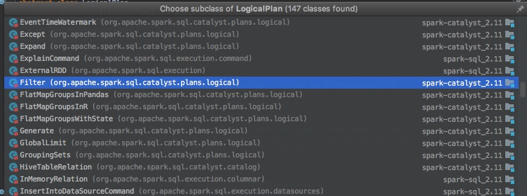

# Spark SQL解析过程

Spark的sql模块负责这部分工作。

SQL -> RDD/DataFrame的操作是sql解析，代码生成的过程。

## 先介绍RDD外的两个基本概念
DataFrame和DataSet

* DataSet是该模块核心的数据结果。
* DataFrame在DataSet上又封装了一层。类似于pandas的dataframe，可以在上面进行各种聚合，filter等类sql操作。

DataFrame和DataSet的关系如下:
```
type DataFrame = Dataset[Row]

```


## 怎么样提升SQL查询效率
1. 减少SQL解析时间
2. SQL优化，分两部分
- 用户要写好sql
- 解释器对用户sql再进行一次优化
- UDF以及Spark RDD等内核层的执行效率。

## 解析过程
1: 入口函数：SparkSession.sql("select * from xxx")
```
  /**
   * Executes a SQL query using Spark, returning the result as a `DataFrame`.
   * The dialect that is used for SQL parsing can be configured with 'spark.sql.dialect'.
   *
   * @since 2.0.0
   */
  def sql(sqlText: String): DataFrame = {
    Dataset.ofRows(self, sessionState.sqlParser.parsePlan(sqlText))
  }
```

2：SQL编译成AST语法树。

核心函数为这个ParserDriver里面的parse函数。用到了antlr这个包。antlr是一个开源的语法分析器
```
protected def parse[T](command: String)(toResult: SqlBaseParser => T): T = {
    logDebug(s"Parsing command: $command")

    val lexer = new SqlBaseLexer(new ANTLRNoCaseStringStream(command))
    lexer.removeErrorListeners()
    lexer.addErrorListener(ParseErrorListener)

    val tokenStream = new CommonTokenStream(lexer)
    val parser = new SqlBaseParser(tokenStream)
    parser.addParseListener(PostProcessor)
    parser.removeErrorListeners()
    parser.addErrorListener(ParseErrorListener)

    try {
      try {
        // first, try parsing with potentially faster SLL mode
        parser.getInterpreter.setPredictionMode(PredictionMode.SLL)
        toResult(parser)
      }
      catch {
        case e: ParseCancellationException =>
          // if we fail, parse with LL mode
          tokenStream.reset() // rewind input stream
          parser.reset()

          // Try Again.
          parser.getInterpreter.setPredictionMode(PredictionMode.LL)
          toResult(parser)
      }
    }
    catch {
      case e: ParseException if e.command.isDefined =>
        throw e
      case e: ParseException =>
        throw e.withCommand(command)
      case e: AnalysisException =>
        val position = Origin(e.line, e.startPosition)
        throw new ParseException(Option(command), e.message, position, position)
    }
  }
}
```


3：语法解析：AstBuilder把语法树翻译成逻辑执行图。再通过DataSet的ofRows函数生成DataSet。
```
/**
 * The AstBuilder converts an ANTLR4 ParseTree into a catalyst Expression, LogicalPlan or
 * TableIdentifier.
 */
class AstBuilder(conf: SQLConf) extends SqlBaseBaseVisitor[AnyRef] with Logging {
  import ParserUtils._

  def this() = this(new SQLConf())
```


4：输出结果：DataSet和RDD一样是惰性执行的。只用调用createOrReplaceTempView或者show等action算子才会计算SQL的输出。


## 补充
所有对dataframe的操作都继承了 LogicalPlan这个抽象类，比如join,flatmap等等。
 <div  align="center"></div><br>


